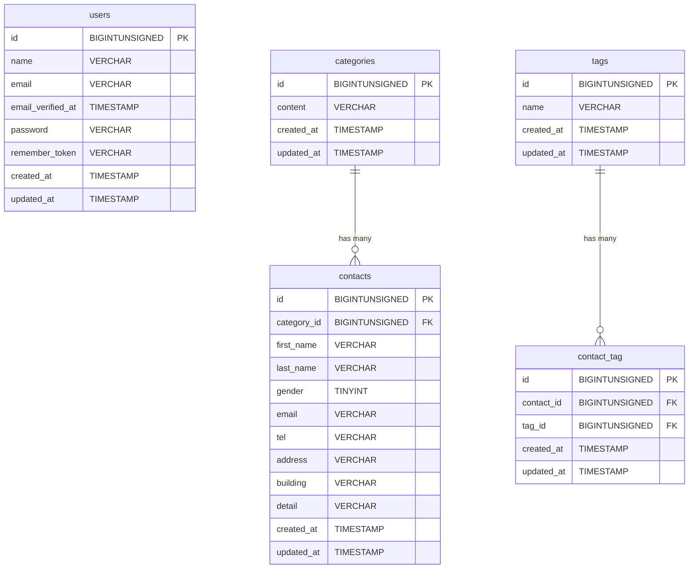

# COACHTECH お問い合わせフォーム

誰でも利用できるお問い合わせフォームです。
管理画面では、送信されたお問い合わせの閲覧・削除ができます。
また、お問い合わせ時に選択するタグの追加・編集・削除も可能です。

## 作成者

赤池美優

## 使用技術

- **言語**: PHP 8.5.9
- **フレームワーク**: Laravel Framework 10.50.2
- **データベース**: MySQL 8.4.11
- **フロントエンド**: Tailwinid CSS 3.4.19
- **ビルドツール**: Vite 5.4.21
- **開発環境**: Doocker 27.3.1, laravel/sail 1.65.0
- **バージョン管理**: Git 2.43.0
- **その他**: Composer version 2.10.2, node 24.19.0, npm 12.0.2

## ER図



## 開発環境URL

http://localhost

## 動作環境

Windows11上のWSL(Ubuntu)で開発しています。
また、Docker上でPHP、Laravel、MySQLを使用して動作しています。

## 環境構築手順

1. **リポジトリをクローン**

    ```
    git clone https://github.com/miyori-knzk/contact-form-app.git
    ```

2. **.envファイルの準備**

    プロジェクトフォルダに移動し、
    .env.exsampleをコピーして.envを作成

    ```
    cd contact-form-app
    cp .env.example .env
    ```

    .envファイルを開き、データベース情報が以下のようになっているか確認

    ```
    DB_CONNECTION=mysql
    DB_HOST=mysql
    DB_PORT=3306
    DB_DATABASE=laravel
    DB_USERNAME=sail
    DB_PASSWORD=password
    ```

3. **Composer依存パッケージのインストール**

    ```
    docker run --rm
    -u "$(id -u):$(id -g)"
    -v "$(pwd):/var/www/html"
    -w /var/www/html
    -e COMPOSER_CACHE_DIR=/tmp/composer_cache
    laravelsail/php82-composer:latest
    composer install --ignore-platform-reqs
    ```

4. **Laravel Sailの起動**

    ```
    ./vendor/bin/sail up -d
    ```

5. **NPM依存パッケージのインストール**

    ```
    ./vendor/bin/sail npm install
    ```

6. **アプリケーションキーの生成**

    ```
    ./vendor/bin/sail artisan key:generate
    ```

7. **データベースのマイグレーションと初期データ投入**

    マイグレーションの実行

    ```
    ./vendor/bin/sail artisan migrate
    ```

    初期データ投入

    ```
    ./vendor/bin/sail artisan db:seed
    ```

8. **フロントエンドのビルド**

    ```
    ./vendor/bin/sail npm run build
    ```

9. **アプリケーションへのアクセス**
    - ブラウザで<http://localhost>にアクセスしお問い合わせフォームが表示されるか確認。
    - ブラウザで<http://localhost/admin>にアクセスしログイン画面が表示されるか確認。テストユーザーでログインする  
      メールアドレス：test@example.com  
      パスワード： password
    - ブラウザで<http://localhost:8080>にアクセスしphpMyAdminが表示されるか確認

## テスト実行

.envファイルに以下の行を追加

```
XDEBUG_MODE=coverage
```

コンテナの再起動

```
./vendor/bin/sail down
./vendor/bin/sail up -d
./vendor/bin/sail npm run dev
```

別のターミナルタブでテストコマンドを実行

```
./vendor/bin/sail test
./vendor/bin/sail artisan test --coverage
```

## 機能一覧

- 管理画面(お問い合わせの一覧・検索、お問い合わせの削除、タグの追加・編集・削除)
- お問い合わせフォーム(入力、入力内容確認画面、サンクスページの表示)

## APIエンドポイント一覧

未実装
